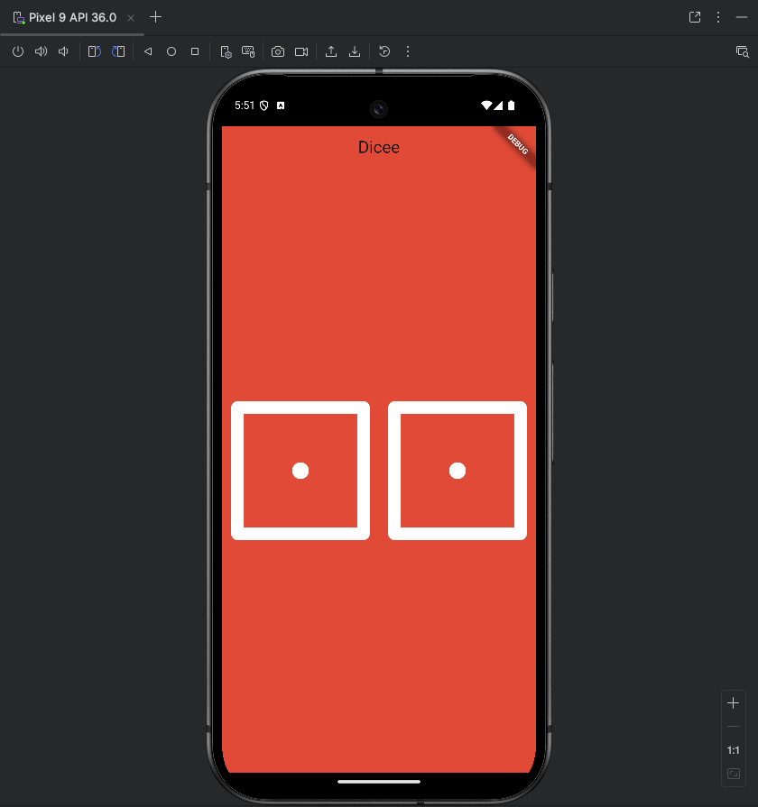
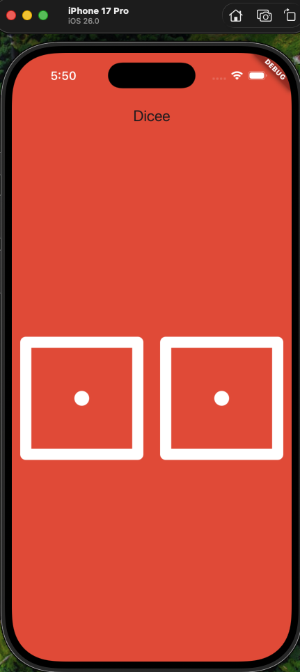

# Dicee 🎲

Welcome to Dicee, your new favorite pocket companion for all things dice-related! Ever found yourself in need of a die but without one in sight? Fear not! Dicee is here to save the day. Built with love and Flutter, this app gives you two dice to roll with a simple tap.

## ✨ Features

*   **Vibrant Red UI:** A bold and beautiful interface that's easy on the eyes.
*   **Two is Better Than One:** Why roll one die when you can roll two at the same time?
*   **Instant Results:** Get your random numbers with a single tap.
*   **Simple & Fun:** No complicated rules, just pure, unadulterated dice-rolling fun.

## 📸 Screenshots

### Android

 

### iOS

 

## 🚀 How to Play

1.  Open the app.
2.  Tap on either of the dice on the screen.
3.  Voilà! Watch the magic happen as both dice roll to reveal new numbers.

## 💻 Tech Stack

*   **Flutter:** Google's UI toolkit for building beautiful, natively compiled applications for mobile, web, and desktop from a single codebase.
*   **Dart:** The language of Flutter.

## Getting Started (for Developers)

To get a local copy up and running, follow these simple steps.

### Prerequisites

*   Flutter SDK: [https://flutter.dev/docs/get-started/install](https://flutter.dev/docs/get-started/install)

### Installation

1.  Clone the repo
    ```sh
    git clone https://github.com/your_username_/dicee-flutter.git
    ```
2.  Install packages
    ```sh
    flutter pub get
    ```
3.  Run the app
    ```sh
    flutter run
    ```

## 🔮 Future Ideas

*   Haptic feedback on roll.
*   Cool sound effects.
*   Change dice color.
*   Support for different types of dice (d4, d8, d10, d12, d20).
